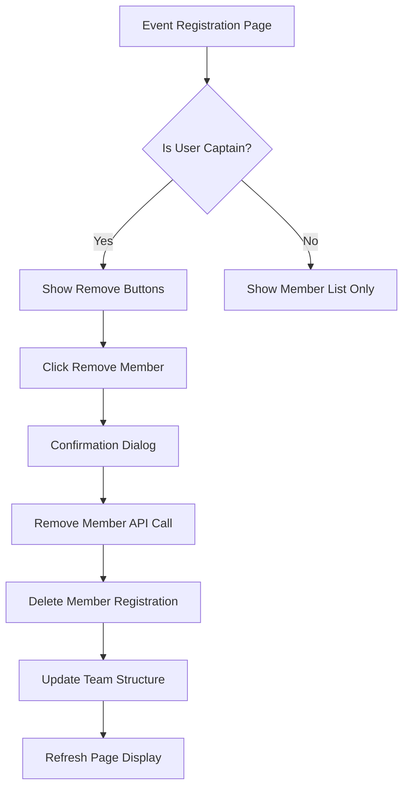

## 1. Product Overview
Enhance the relay team functionality by adding team captain identification and member management capabilities. This feature allows team initiators to have administrative control over their teams, including the ability to remove members and maintain data consistency across all team registrations.

## 2. Core Features

### 2.1 User Roles
| Role | Registration Method | Core Permissions |
|------|---------------------|------------------|
| Team Captain | Team initiator (captain: true) | Can remove team members, manage team composition |
| Team Member | Invited to team (captain: false) | Can participate in team events, view team information |

### 2.2 Feature Module
Our relay team captain requirements consist of the following main enhancements:
1. **Team Structure Enhancement**: Add captain field to identify team leadership
2. **Event Registration Page**: Enhanced UI with member management controls
3. **Member Management System**: Backend logic for safe member removal

### 2.3 Page Details
| Page Name | Module Name | Feature description |
|-----------|-------------|---------------------|
| Event Registration Page | Team Member List | Display all team members with captain indicator (crown icon or "Captain" badge) |
| Event Registration Page | Remove Member Button | Show "Remove" button next to each member (only visible to captain), confirm dialog before removal |
| Event Registration Page | Captain Controls | Special UI section for captain-only actions and team management |

## 3. Core Process

**Team Captain Flow:**
1. User initiates relay team → automatically becomes captain (captain: true)
2. Captain invites members → members join with captain: false
3. Captain views event registration page → sees all team members with remove buttons
4. Captain clicks remove member → confirmation dialog appears
5. Captain confirms removal → system deletes member's gameType registration and updates team structure

**Team Member Flow:**
1. Member joins relay team → receives captain: false status
2. Member views event registration page → sees team members but no remove buttons
3. If removed by captain → member's registration is automatically deleted

## 4. User Interface Design

### 4.1 Design Style
- Primary colors: Blue (#007bff) for captain actions, Red (#dc3545) for remove actions
- Button style: Rounded buttons with clear icons (crown for captain, trash for remove)
- Font: System default, 14px for member names, 12px for status indicators
- Layout style: Card-based member list with inline action buttons
- Icon suggestions: Crown emoji 👑 or icon for captain, trash can 🗑️ for remove action

### 4.2 Page Design Overview
| Page Name | Module Name | UI Elements |
|-----------|-------------|-------------|
| Event Registration Page | Team Member Card | Member name, captain badge (if applicable), remove button (captain only), clean card layout with hover effects |
| Event Registration Page | Captain Indicator | Crown icon or "Captain" text badge next to team initiator's name, distinct styling |
| Event Registration Page | Remove Confirmation | Modal dialog with member name, warning text, Cancel/Confirm buttons, red accent for destructive action |

### 4.3 Responsiveness
Desktop-first design with mobile-adaptive layout. Touch-friendly button sizes for mobile devices, with adequate spacing between remove buttons to prevent accidental taps.

## 5. Business Rules

### 5.1 Captain Assignment
- Team initiator automatically receives captain: true status
- Only one captain per team (cannot be transferred)
- Captain status is permanent and cannot be changed

### 5.2 Member Removal Rules
- Only team captain can remove members
- Captain cannot remove themselves
- Removing a member deletes their entire gameType registration for that event
- Removal is immediate and cannot be undone
- Team must have at least 2 members (captain + 1 member) to remain valid

### 5.3 Data Consistency
- When member is removed, all associated EventRegistration records are deleted
- Team structure is updated to reflect current membership
- Remaining members' registrations remain intact with same gameType._id
- System maintains referential integrity across all related collections