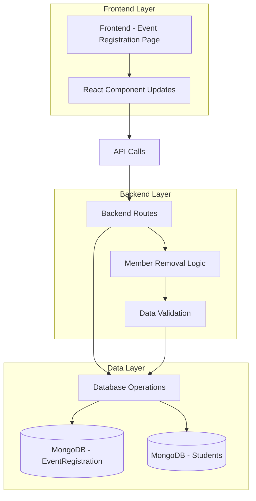
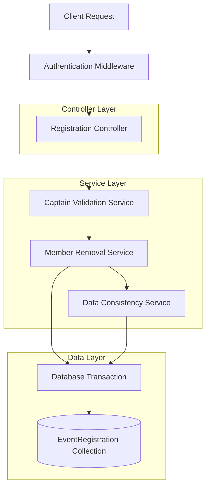
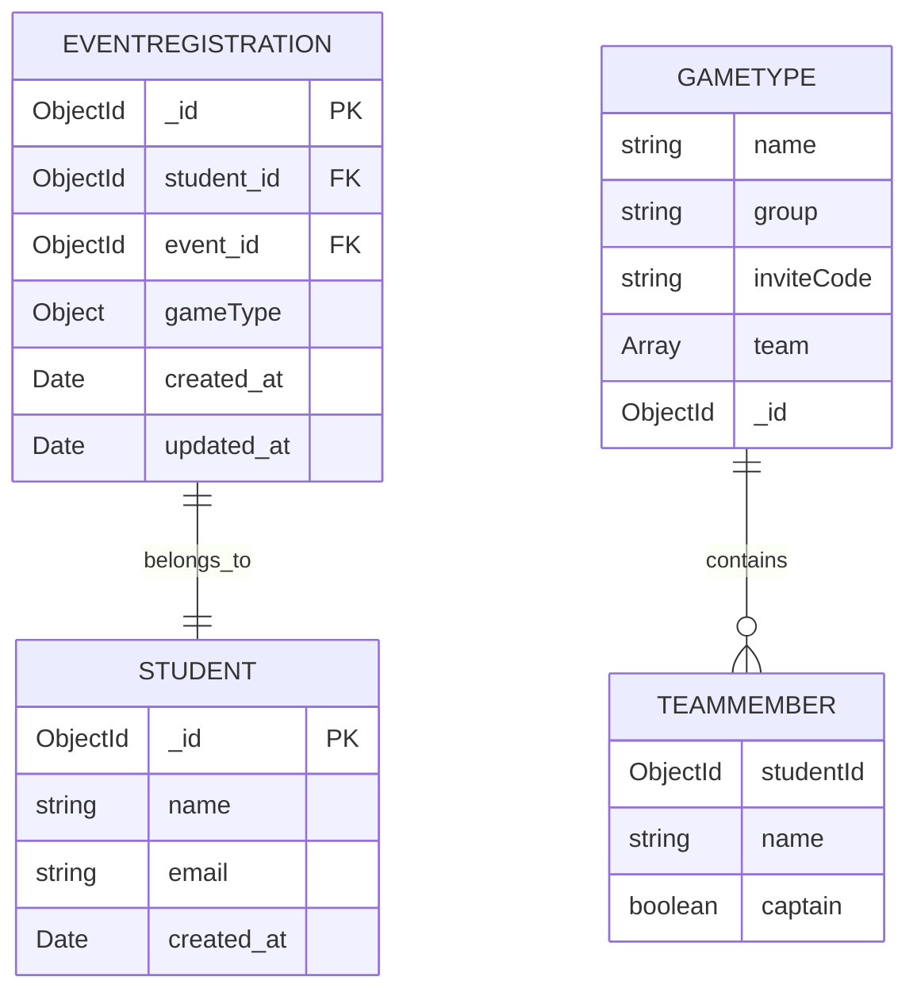

## 1. Architecture Design



## 2. Technology Description
- Frontend: React@18 + tailwindcss@3 + vite
- Backend: Express@4 + MongoDB + Mongoose
- Database: MongoDB (existing collections: EventRegistration, Students)

## 3. Route Definitions
| Route | Purpose |
|-------|---------|
| /events/:eventId/register | Enhanced event registration page with captain controls |
| /api/registrations/:registrationId/remove-member | New API endpoint for removing team members |
| /api/registrations/:eventId | Enhanced to include captain information in response |

## 4. API Definitions

### 4.1 Core API

**Remove Team Member**
```
DELETE /api/registrations/:registrationId/remove-member
```

Request:
| Param Name | Param Type | isRequired | Description |
|------------|------------|------------|-------------|
| registrationId | string | true | The registration ID of the member to remove |
| captainId | string | true | The student ID of the captain making the request |

Response:
| Param Name | Param Type | Description |
|------------|------------|-------------|
| success | boolean | Whether the removal was successful |
| message | string | Success or error message |
| remainingMembers | number | Number of team members remaining |

Example Request:
```json
{
  "captainId": "507f1f77bcf86cd799439011"
}
```

Example Response:
```json
{
  "success": true,
  "message": "Team member removed successfully",
  "remainingMembers": 2
}
```

**Enhanced Registration Data**
```
GET /api/registrations/:eventId
```

Response includes captain field:
```json
{
  "registrations": [
    {
      "_id": "507f1f77bcf86cd799439011",
      "student": {
        "_id": "507f1f77bcf86cd799439012",
        "name": "John Doe"
      },
      "gameType": {
        "name": "接力赛",
        "team": [
          {
            "studentId": "507f1f77bcf86cd799439012",
            "name": "John Doe",
            "captain": true
          },
          {
            "studentId": "507f1f77bcf86cd799439013",
            "name": "Jane Smith",
            "captain": false
          }
        ]
      }
    }
  ]
}
```

## 5. Server Architecture Diagram



## 6. Data Model

### 6.1 Data Model Definition



### 6.2 Data Definition Language

**Enhanced GameType Schema (Embedded in EventRegistration)**
```javascript
// Updated gameType schema with captain field
const gameTypeSchema = {
  name: String,
  group: String,
  inviteCode: String,
  _id: { type: mongoose.Schema.Types.ObjectId, auto: false },
  team: [{
    studentId: { type: mongoose.Schema.Types.ObjectId, ref: 'Student' },
    name: String,
    captain: { type: Boolean, default: false } // NEW FIELD
  }]
};
```

**Database Migration Script**
```javascript
// Add captain field to existing relay team members
db.eventregistrations.updateMany(
  { "gameType.name": "接力赛" },
  {
    $set: {
      "gameType.team.$[elem].captain": false
    }
  },
  {
    arrayFilters: [{ "elem.captain": { $exists: false } }]
  }
);

// Set first team member as captain for existing teams
db.eventregistrations.aggregate([
  { $match: { "gameType.name": "接力赛" } },
  { $group: { _id: "$gameType.inviteCode", firstReg: { $first: "$$ROOT" } } }
]).forEach(function(doc) {
  db.eventregistrations.updateMany(
    { "gameType.inviteCode": doc._id },
    { $set: { "gameType.team.0.captain": true } }
  );
});
```

**New API Route Implementation**
```javascript
// Remove team member endpoint
router.delete('/registrations/:registrationId/remove-member', async (req, res) => {
  try {
    const { registrationId } = req.params;
    const { captainId } = req.body;
    
    // 1. Validate captain permissions
    const targetRegistration = await EventRegistration.findById(registrationId);
    const captainRegistration = await EventRegistration.findOne({
      student: captainId,
      'gameType.inviteCode': targetRegistration.gameType.inviteCode
    });
    
    // 2. Check if requester is captain
    const isCaptain = captainRegistration.gameType.team.some(
      member => member.studentId.toString() === captainId && member.captain === true
    );
    
    if (!isCaptain) {
      return res.status(403).json({ success: false, message: 'Only team captain can remove members' });
    }
    
    // 3. Remove member's registration
    await EventRegistration.deleteOne({ _id: registrationId });
    
    // 4. Update remaining team members' gameType.team array
    const inviteCode = targetRegistration.gameType.inviteCode;
    const removedStudentId = targetRegistration.student;
    
    await EventRegistration.updateMany(
      { 'gameType.inviteCode': inviteCode },
      { $pull: { 'gameType.team': { studentId: removedStudentId } } }
    );
    
    // 5. Count remaining members
    const remainingCount = await EventRegistration.countDocuments({
      'gameType.inviteCode': inviteCode
    });
    
    res.json({
      success: true,
      message: 'Team member removed successfully',
      remainingMembers: remainingCount
    });
    
  } catch (error) {
    res.status(500).json({ success: false, message: error.message });
  }
});
```

## 7. Frontend Component Changes

### 7.1 Enhanced Team Member Display Component
```javascript
// TeamMemberCard component with captain controls
const TeamMemberCard = ({ member, isCurrentUserCaptain, onRemoveMember }) => {
  return (
    <div className="flex items-center justify-between p-3 border rounded-lg">
      <div className="flex items-center space-x-2">
        <span className="font-medium">{member.name}</span>
        {member.captain && (
          <span className="inline-flex items-center px-2 py-1 text-xs font-medium text-yellow-800 bg-yellow-100 rounded-full">
            👑 Captain
          </span>
        )}
      </div>
      {isCurrentUserCaptain && !member.captain && (
        <button
          onClick={() => onRemoveMember(member)}
          className="px-3 py-1 text-sm text-red-600 border border-red-300 rounded hover:bg-red-50"
        >
          Remove
        </button>
      )}
    </div>
  );
};
```

### 7.2 Member Removal Confirmation Modal
```javascript
// Confirmation modal for member removal
const RemoveMemberModal = ({ member, isOpen, onConfirm, onCancel }) => {
  if (!isOpen) return null;
  
  return (
    <div className="fixed inset-0 bg-black bg-opacity-50 flex items-center justify-center">
      <div className="bg-white p-6 rounded-lg max-w-md w-full mx-4">
        <h3 className="text-lg font-semibold mb-4">Remove Team Member</h3>
        <p className="text-gray-600 mb-6">
          Are you sure you want to remove <strong>{member.name}</strong> from the team? 
          This will delete their registration for this event and cannot be undone.
        </p>
        <div className="flex space-x-3 justify-end">
          <button
            onClick={onCancel}
            className="px-4 py-2 text-gray-600 border border-gray-300 rounded hover:bg-gray-50"
          >
            Cancel
          </button>
          <button
            onClick={onConfirm}
            className="px-4 py-2 text-white bg-red-600 rounded hover:bg-red-700"
          >
            Remove Member
          </button>
        </div>
      </div>
    </div>
  );
};
```