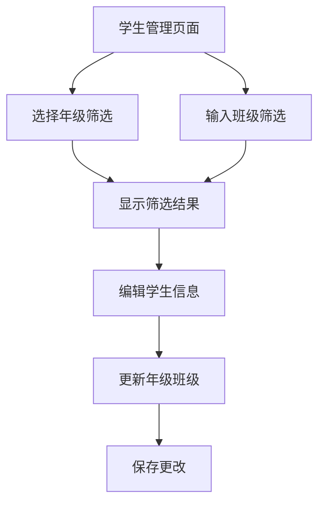

# 学生年级班级字段拆分功能需求文档

## 1. 产品概述

本功能旨在优化学生数据管理系统，将当前的复合年级字段（如"初三16班"）拆分为独立的年级和班级字段，提升数据管理的精确性和用户体验。

该功能解决了当前年级班级信息混合存储导致的查询不精确、数据管理复杂等问题，为教练和管理员提供更便捷的学生信息管理方式。

## 2. 核心功能

### 2.1 用户角色

| 角色 | 权限描述 | 核心功能 |
|------|----------|----------|
| 教练 | 学生信息管理权限 | 可以查看、筛选、编辑学生的年级和班级信息 |
| 管理员 | 系统管理权限 | 可以执行数据迁移、管理所有学生信息 |

### 2.2 功能模块

本需求涉及以下主要页面的更新：

1. **学生管理页面**: 更新筛选器和表单，支持独立的年级和班级选择
2. **学生列表页面**: 显示拆分后的年级和班级信息
3. **学生编辑页面**: 提供独立的年级和班级输入控件

### 2.3 页面详情

| 页面名称 | 模块名称 | 功能描述 |
|----------|----------|----------|
| 学生管理页面 | 筛选器模块 | 提供年级下拉选择（精确匹配）、班级数字输入框，支持组合筛选 |
| 学生管理页面 | 学生列表 | 分别显示年级和班级列，支持按年级和班级排序 |
| 学生编辑页面 | 基本信息表单 | 独立的年级选择下拉框（初一-高三）和班级数字输入框 |
| 学生创建页面 | 基本信息表单 | 必填的年级选择和班级输入，支持表单验证 |

## 3. 核心流程

### 3.1 教练用户流程

教练用户可以通过以下流程管理学生信息：
1. 进入学生管理页面
2. 使用年级下拉框选择特定年级（如"初三"）
3. 可选择输入班级号码进行进一步筛选
4. 查看筛选后的学生列表
5. 点击编辑学生信息，在表单中分别修改年级和班级

### 3.2 数据迁移流程

管理员执行数据迁移的流程：
1. 备份现有数据库
2. 运行数据迁移脚本
3. 验证迁移结果
4. 更新前端应用

## 4. 用户界面设计

### 4.1 设计风格

- **主色调**: 蓝色系（#3B82F6）和灰色系（#6B7280）
- **按钮样式**: 圆角按钮，悬停效果
- **字体**: 系统默认字体，标题16px，正文14px
- **布局风格**: 卡片式布局，响应式设计
- **图标风格**: 使用Lucide图标库，简洁现代

### 4.2 页面设计概览

| 页面名称 | 模块名称 | UI元素 |
|----------|----------|--------|
| 学生管理页面 | 筛选器区域 | 年级下拉选择器（带搜索），班级数字输入框，筛选按钮，重置按钮 |
| 学生管理页面 | 学生列表 | 表格布局，年级列，班级列，操作按钮，分页控件 |
| 学生编辑表单 | 基本信息区域 | 年级选择下拉框（初一/初二/初三/高一/高二/高三），班级输入框（数字验证） |
| 学生创建表单 | 基本信息区域 | 必填标识的年级选择器，班级输入框，表单验证提示 |

### 4.3 交互设计细节

#### 筛选器交互
- **年级选择器**: 下拉菜单，支持键盘导航，选中后立即触发筛选
- **班级输入框**: 数字输入，支持回车键触发筛选，实时验证输入格式
- **筛选结果**: 实时更新，显示匹配数量，支持清空筛选条件

#### 表单交互
- **年级选择**: 必填字段，下拉选择，有默认提示文本
- **班级输入**: 必填字段，数字输入，1-50范围验证，错误提示
- **保存操作**: 表单验证通过后启用保存按钮，显示保存状态

### 4.4 响应式设计

- **桌面端优先**: 主要针对教练在电脑上使用的场景
- **移动端适配**: 筛选器在移动端折叠显示，表单采用垂直布局
- **触摸优化**: 按钮和输入框适合触摸操作的尺寸

## 5. 数据验证规则

### 5.1 年级字段验证
- **必填**: 年级字段不能为空
- **枚举值**: 只能选择初一、初二、初三、高一、高二、高三
- **格式**: 必须是中文字符

### 5.2 班级字段验证
- **必填**: 班级字段不能为空
- **数字格式**: 只能输入数字
- **范围限制**: 1-50之间的整数
- **去除空格**: 自动去除前后空格

## 6. 性能要求

### 6.1 查询性能
- 年级和班级组合查询响应时间 < 500ms
- 支持大量学生数据的快速筛选
- 添加数据库索引优化查询性能

### 6.2 用户体验
- 筛选操作实时响应，无明显延迟
- 表单验证即时反馈
- 数据保存操作有明确的状态提示

## 7. 兼容性要求

### 7.1 浏览器兼容性
- Chrome 90+
- Firefox 88+
- Safari 14+
- Edge 90+

### 7.2 数据兼容性
- 保持与现有数据的向下兼容
- 迁移过程中不丢失任何学生信息
- 支持迁移过程的回滚操作