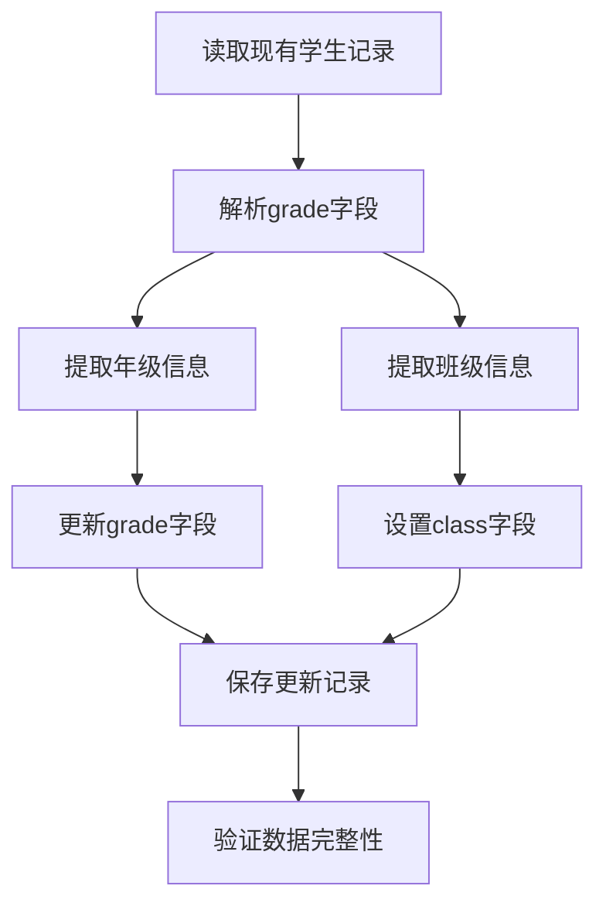
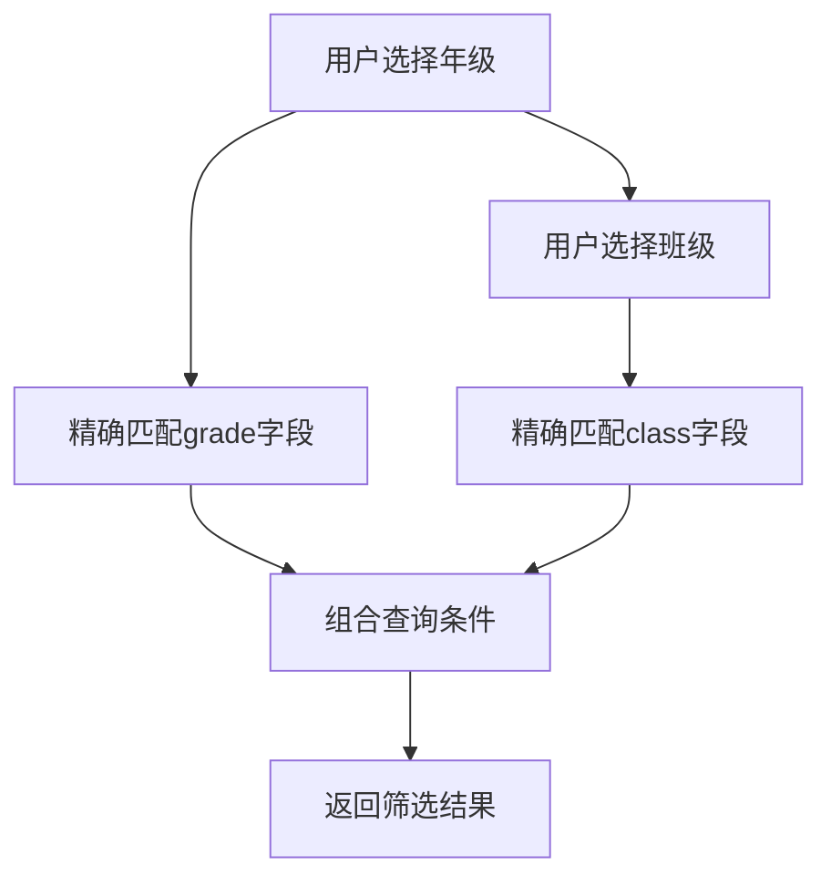
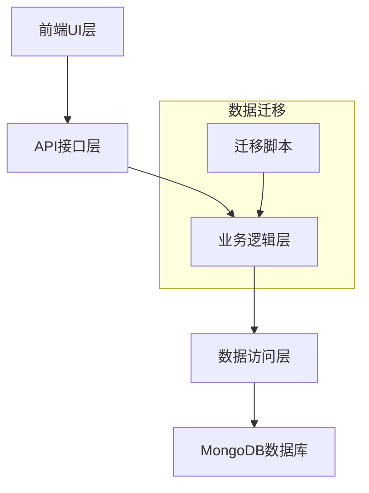
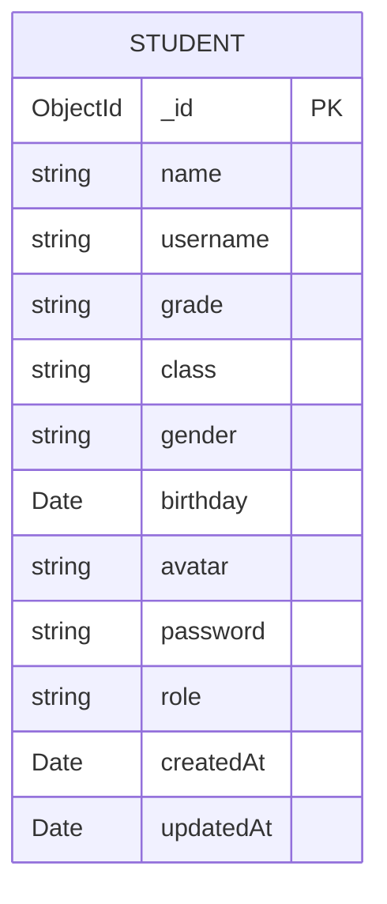

# 学生数据模型Grade字段拆分技术文档

## 1. 项目概述

本文档描述了将学生数据模型中的grade字段拆分为独立的grade（年级）和class（班级）字段的技术实现方案。当前grade字段包含如"初三16班"、"初二16班"等复合信息，需要拆分为"初三"（年级）和"16"（班级编号）两个独立字段。

## 2. 核心功能

### 2.1 数据库模型更新

#### 当前模型结构
```javascript
grade: {
  type: String,
  required: true,
  trim: true
}
```

#### 更新后模型结构
```javascript
grade: {
  type: String,
  required: true,
  trim: true,
  enum: ['初一', '初二', '初三', '高一', '高二', '高三']
},
class: {
  type: String,
  required: true,
  trim: true
}
```

### 2.2 数据迁移脚本

创建批量更新脚本，解析现有grade字段并拆分为grade和class字段：

```javascript
// 数据解析逻辑
const parseGradeAndClass = (originalGrade) => {
  // 提取前两个中文字符作为年级
  const grade = originalGrade.substring(0, 2);
  // 提取数字部分作为班级，去掉最后的"班"字
  const classMatch = originalGrade.match(/\d+/);
  const classNumber = classMatch ? classMatch[0] : '1';
  return { grade, class: classNumber };
};
```

### 2.3 前端UI更新

#### 筛选逻辑优化
- **当前逻辑**: 使用包含查询（contains）匹配年级前两个字符
- **更新后逻辑**: 使用精确匹配（equals）查询grade字段

#### 班级下拉选择
- 添加独立的班级选择下拉框
- 支持数字输入或下拉选择
- 与年级选择联动

## 3. 核心流程

### 3.1 数据迁移流程


### 3.2 前端筛选流程


## 4. 技术架构

### 4.1 架构设计


### 4.2 技术栈
- 后端: Node.js + Express + Mongoose
- 前端: React + JavaScript
- 数据库: MongoDB

### 4.3 API接口更新

#### 学生查询接口
```
GET /api/students
```

更新后查询参数:
| 参数名 | 参数类型 | 是否必需 | 描述 |
|--------|----------|----------|------|
| grade | string | false | 年级（精确匹配） |
| class | string | false | 班级编号 |
| name | string | false | 学生姓名 |

#### 学生创建/更新接口
```
POST /api/students
PUT /api/students/:id
```

请求体更新:
```json
{
  "name": "张三",
  "grade": "初三",
  "class": "16",
  "gender": "男"
}
```

## 5. 数据模型

### 5.1 数据模型定义


### 5.2 数据定义语言

#### 更新Student模型
```javascript
const mongoose = require('mongoose');
const bcrypt = require('bcryptjs');

const studentSchema = new mongoose.Schema({
  name: {
    type: String,
    required: true,
    trim: true
  },
  username: {
    type: String,
    unique: true,
    sparse: true,
    trim: true
  },
  grade: {
    type: String,
    required: true,
    trim: true,
    enum: ['初一', '初二', '初三', '高一', '高二', '高三']
  },
  class: {
    type: String,
    required: true,
    trim: true
  },
  gender: {
    type: String,
    enum: ['男', '女'],
    default: '男'
  },
  birthday: {
    type: Date,
    default: null
  },
  avatar: {
    type: String,
    default: ''
  },
  password: {
    type: String,
    required: true,
    default: '88888888'
  },
  role: {
    type: String,
    enum: ['student', 'coach'],
    default: 'student'
  }
}, {
  timestamps: true
});

// 添加复合索引以优化查询性能
studentSchema.index({ grade: 1, class: 1 });

module.exports = mongoose.model('Student', studentSchema);
```

#### 数据迁移脚本
```javascript
// migrate-grade-class.js
const mongoose = require('mongoose');
const Student = require('./models/Student');

async function migrateGradeClass() {
  try {
    console.log('开始迁移grade字段...');
    
    const students = await Student.find({});
    console.log(`找到 ${students.length} 条学生记录`);
    
    for (let student of students) {
      const originalGrade = student.grade;
      
      // 解析年级和班级
      const grade = originalGrade.substring(0, 2);
      const classMatch = originalGrade.match(/\d+/);
      const classNumber = classMatch ? classMatch[0] : '1';
      
      // 更新记录
      await Student.updateOne(
        { _id: student._id },
        { 
          grade: grade,
          class: classNumber
        }
      );
      
      console.log(`更新学生 ${student.name}: ${originalGrade} -> 年级: ${grade}, 班级: ${classNumber}`);
    }
    
    console.log('迁移完成！');
  } catch (error) {
    console.error('迁移失败:', error);
  }
}

// 执行迁移
if (require.main === module) {
  mongoose.connect(process.env.MONGODB_URI || 'mongodb://localhost:27017/orienteering_quiz')
    .then(() => {
      console.log('数据库连接成功');
      return migrateGradeClass();
    })
    .then(() => {
      console.log('迁移脚本执行完成');
      process.exit(0);
    })
    .catch(error => {
      console.error('脚本执行失败:', error);
      process.exit(1);
    });
}

module.exports = migrateGradeClass;
```

## 6. 实施计划

### 6.1 实施步骤
1. **数据库模型更新** - 更新Student.js模型定义
2. **创建迁移脚本** - 编写并测试数据迁移脚本
3. **后端API更新** - 更新相关路由和查询逻辑
4. **前端UI更新** - 修改学生管理页面的筛选和表单逻辑
5. **测试验证** - 全面测试新功能
6. **数据迁移** - 在生产环境执行迁移脚本

### 6.2 风险评估
- **数据完整性风险**: 迁移过程中可能出现数据解析错误
- **向下兼容性**: 需要确保现有功能不受影响
- **性能影响**: 新增字段和索引对查询性能的影响

### 6.3 回滚方案
- 保留原始grade字段作为备份
- 创建回滚脚本以恢复原始数据结构
- 建立数据库备份机制