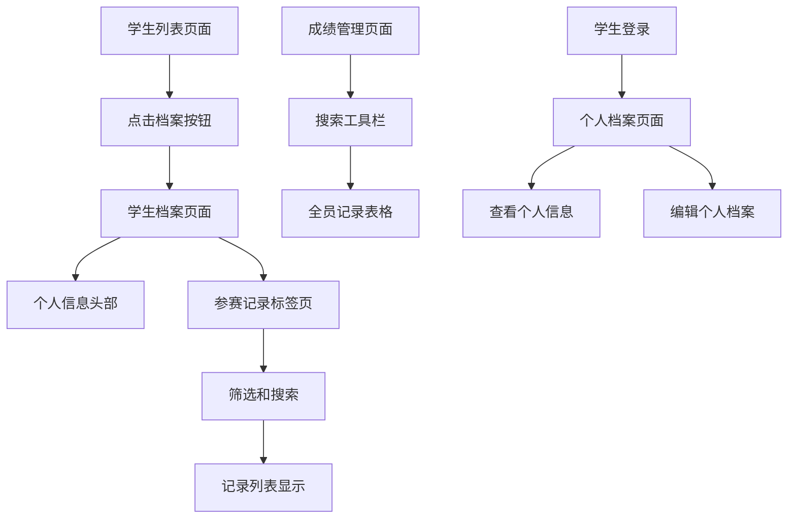

# 学生档案和参赛记录管理功能需求文档

## 1. 产品概述

学生档案和参赛记录管理系统是一个综合性的学生信息管理平台，为教练和学生提供完整的个人档案查看、参赛记录管理和成绩统计功能。系统通过整合学生基本信息和参赛记录数据，为定向运动队伍管理提供全面的数据支持和分析工具。

## 2. 核心功能

### 2.1 用户角色

| 角色 | 访问权限 | 核心权限 |
|------|----------|----------|
| 教练 | 完全访问权限 | 查看所有学生档案、管理参赛记录、访问成绩管理页面 |
| 学生 | 个人档案权限 | 查看和编辑个人档案、查看个人参赛记录 |

### 2.2 功能模块

本系统包含以下主要页面：
1. **学生档案页面**：显示学生个人信息头部区域和参赛记录标签页
2. **参赛记录标签页**：展示学生的所有参赛记录，支持筛选和排序
3. **成绩管理页面**：教练端管理所有学生的参赛记录
4. **个人档案编辑**：学生端个人信息更新功能

### 2.3 页面详情

| 页面名称 | 模块名称 | 功能描述 |
|----------|----------|----------|
| 学生档案页面 | 个人信息头部 | 显示头像、姓名、年龄（基于生日计算）、年级、性别等基本信息 |
| 学生档案页面 | 标签页导航 | 提供"参赛记录"等标签页切换功能 |
| 参赛记录标签页 | 筛选工具栏 | 提供时间筛选（近3个月、6个月、1年）和事件名称文本搜索 |
| 参赛记录标签页 | 记录列表 | 现代化表格设计，显示事件名称、类型、成绩、组别、有效性、排名、日期 |
| 参赛记录标签页 | 排序功能 | 支持按日期等字段点击表头排序 |
| 成绩管理页面 | 搜索工具栏 | 提供姓名搜索、时间筛选和事件名称搜索 |
| 成绩管理页面 | 全员记录表格 | 显示所有学生的参赛记录，支持多维度筛选和排序 |
| 个人档案编辑 | 信息更新表单 | 学生可更新年级、生日、头像等个人信息 |

## 3. 核心流程

**教练查看学生档案流程：**
1. 教练在学生列表页面点击新增的"档案"按钮
2. 进入学生档案页面，查看学生基本信息
3. 切换到"参赛记录"标签页
4. 使用筛选工具查看特定时间段或事件的记录
5. 点击表头进行排序分析

**教练管理成绩流程：**
1. 教练导航到"成绩管理"页面
2. 使用搜索栏筛选特定学生或事件
3. 查看和分析所有学生的参赛数据
4. 进行成绩统计和分析

**学生查看个人档案流程：**
1. 学生使用个人姓名登录系统
2. 访问个人档案页面
3. 查看个人基本信息和参赛记录
4. 编辑和更新个人信息

## 4. 用户界面设计

### 4.1 设计风格

- **主色调**：蓝色系（#3B82F6）和白色背景
- **辅助色**：灰色系用于文本和边框，绿色用于成功状态
- **按钮样式**：现代化圆角设计，悬停和点击效果
- **字体**：系统默认字体，标题16-20px，正文14px
- **布局风格**：卡片式和表格式结合，清晰的信息层次
- **图标样式**：简洁的线性图标，统一的视觉风格

### 4.2 页面设计概览

| 页面名称 | 模块名称 | UI元素 |
|----------|----------|--------|
| 学生档案页面 | 个人信息头部 | 大头像（圆形，120px）、姓名（大标题）、年龄/年级/性别（标签式显示） |
| 参赛记录标签页 | 筛选工具栏 | 下拉选择器（时间筛选）、搜索输入框（事件名称），现代化样式 |
| 参赛记录标签页 | 记录表格 | 斑马纹表格、可点击表头、悬停高亮行、响应式设计 |
| 成绩管理页面 | 搜索区域 | 多个搜索输入框水平排列，统一的搜索按钮样式 |
| 个人档案编辑 | 编辑表单 | 现代化表单设计、文件上传组件、保存按钮突出显示 |

### 4.3 响应式设计

- **桌面端优先**：表格完整显示所有列，宽松的间距设计
- **平板适配**：表格可横向滚动，保持核心信息可见
- **移动端优化**：卡片式布局替代表格，触摸友好的交互设计
- **头像和按钮**：在移动端适当调整尺寸，保持良好的触摸体验