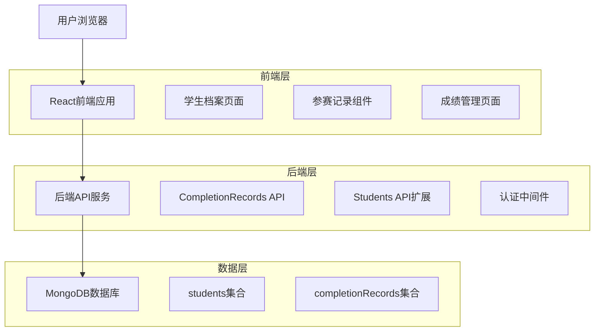
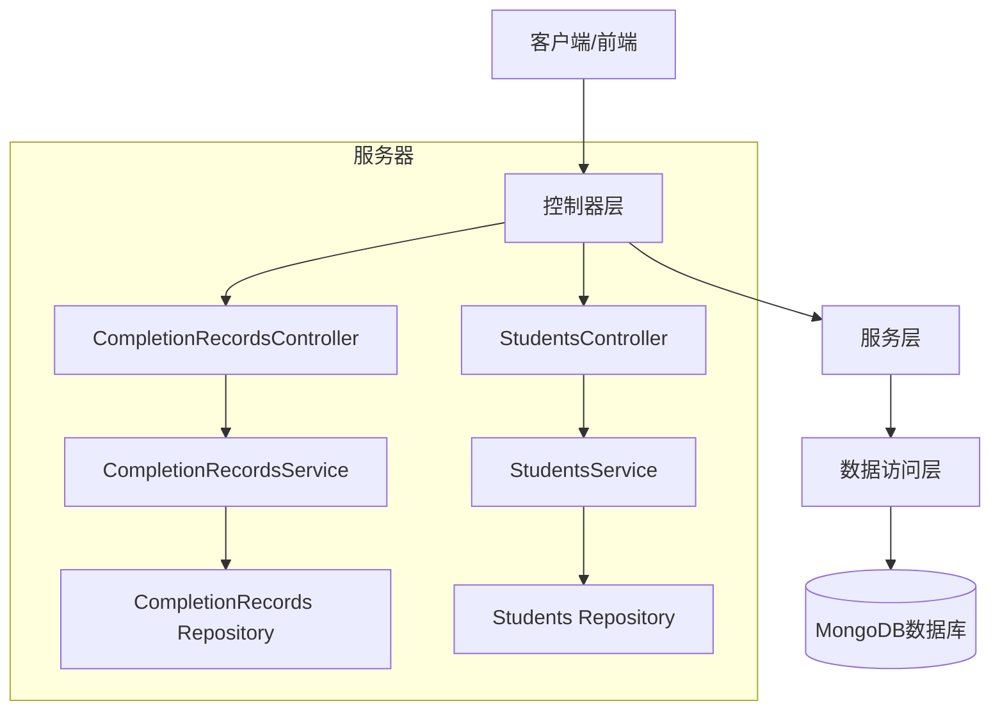
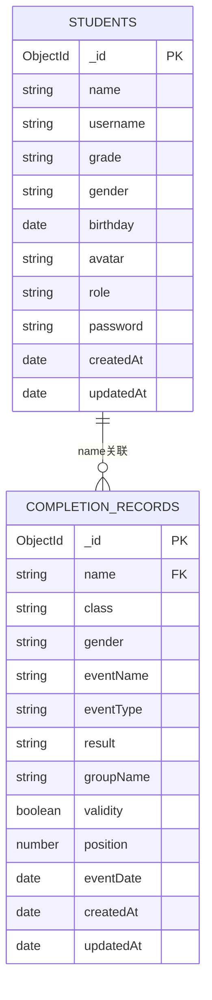

# 学生档案和参赛记录管理技术架构文档

## 1. 架构设计



## 2. 技术描述

- 前端：React@18 + tailwindcss@3 + vite + react-router-dom
- 后端：Express@4 + Node.js + mongoose
- 数据库：MongoDB (现有students集合 + 新增completionRecords集合)
- 认证：JWT token认证机制

## 3. 路由定义

| 路由 | 用途 |
|------|------|
| /coach/students | 学生列表页面，新增"档案"按钮 |
| /coach/student-profile/:id | 学生档案页面，显示个人信息和参赛记录 |
| /coach/performance-management | 成绩管理页面，管理所有学生参赛记录 |
| /student/profile | 学生个人档案页面，可编辑个人信息 |
| /student/profile/edit | 学生个人信息编辑页面 |

## 4. API定义

### 4.1 核心API

#### 参赛记录相关API

获取学生参赛记录
```
GET /api/completion-records/:studentName
```

请求参数：
| 参数名称 | 参数类型 | 是否必需 | 描述 |
|----------|----------|----------|------|
| studentName | string | true | 学生姓名 |
| startDate | string | false | 开始日期 (YYYY-MM-DD) |
| endDate | string | false | 结束日期 (YYYY-MM-DD) |
| eventName | string | false | 事件名称搜索关键词 |
| sortBy | string | false | 排序字段 (eventDate, result) |
| sortOrder | string | false | 排序方向 (asc, desc) |

响应数据：
```json
{
  "success": true,
  "data": {
    "records": [
      {
        "_id": "68c50d9382eaf0375a9df31e",
        "name": "漆修睿",
        "class": "初二11班",
        "gender": "男",
        "eventName": "2.15-16小马中心湖",
        "eventType": "3-column",
        "result": "00:54:59.0010",
        "groupName": "小黑马",
        "validity": true,
        "position": null,
        "eventDate": "2025-02-15"
      }
    ],
    "totalCount": 15
  }
}
```

获取所有参赛记录（成绩管理页面）
```
GET /api/completion-records
```

请求参数：
| 参数名称 | 参数类型 | 是否必需 | 描述 |
|----------|----------|----------|------|
| name | string | false | 学生姓名搜索 |
| startDate | string | false | 开始日期 |
| endDate | string | false | 结束日期 |
| eventName | string | false | 事件名称搜索 |
| page | number | false | 页码，默认1 |
| limit | number | false | 每页数量，默认20 |

创建参赛记录
```
POST /api/completion-records
```

请求体：
```json
{
  "name": "学生姓名",
  "class": "班级",
  "gender": "性别",
  "eventName": "事件名称",
  "eventType": "事件类型",
  "result": "成绩",
  "groupName": "组别",
  "validity": true,
  "position": 1,
  "eventDate": "2025-02-15"
}
```

#### 学生档案相关API

获取学生详细档案
```
GET /api/students/:id/profile
```

响应数据：
```json
{
  "success": true,
  "data": {
    "student": {
      "_id": "...",
      "name": "张三",
      "grade": "初二3班",
      "gender": "男",
      "birthday": "2010-05-15",
      "age": 14,
      "avatar": "..."
    },
    "recordsCount": 12
  }
}
```

更新学生档案信息
```
PUT /api/students/:id/profile
```

请求体：
```json
{
  "grade": "初三1班",
  "birthday": "2010-05-15",
  "avatar": "base64图片数据或文件路径"
}
```

## 5. 服务器架构图



## 6. 数据模型

### 6.1 数据模型定义



### 6.2 数据定义语言

#### CompletionRecords集合
```javascript
// 创建completionRecords集合
const completionRecordSchema = new mongoose.Schema({
  name: {
    type: String,
    required: true,
    index: true // 用于关联students集合
  },
  class: {
    type: String,
    required: true
  },
  gender: {
    type: String,
    required: true,
    enum: ['男', '女']
  },
  eventName: {
    type: String,
    required: true,
    index: true // 用于搜索
  },
  eventType: {
    type: String,
    required: true
  },
  result: {
    type: String,
    required: true
  },
  groupName: {
    type: String,
    required: true
  },
  validity: {
    type: Boolean,
    default: true
  },
  position: {
    type: Number,
    default: null
  },
  eventDate: {
    type: Date,
    required: true,
    index: true // 用于时间筛选
  }
}, {
  timestamps: true
});

// 创建复合索引优化查询性能
completionRecordSchema.index({ name: 1, eventDate: -1 });
completionRecordSchema.index({ eventDate: -1, eventName: 1 });
```

#### Students集合扩展
```javascript
// 扩展现有students集合，添加birthday字段
const studentSchema = new mongoose.Schema({
  name: { type: String, required: true },
  username: { type: String, required: true, unique: true },
  grade: { type: String, required: true },
  gender: { type: String, enum: ['男', '女'], default: '男' },
  birthday: { 
    type: Date,
    default: null // 允许为空，后续可补充
  },
  avatar: { type: String, default: '' },
  role: { type: String, default: 'student' },
  password: { type: String, required: true }
}, {
  timestamps: true
});

// 虚拟字段：计算年龄
studentSchema.virtual('age').get(function() {
  if (!this.birthday) return null;
  const today = new Date();
  const birthDate = new Date(this.birthday);
  let age = today.getFullYear() - birthDate.getFullYear();
  const monthDiff = today.getMonth() - birthDate.getMonth();
  if (monthDiff < 0 || (monthDiff === 0 && today.getDate() < birthDate.getDate())) {
    age--;
  }
  return age;
});

// 确保虚拟字段在JSON序列化时包含
studentSchema.set('toJSON', { virtuals: true });
```

#### 初始化数据
```javascript
// 示例参赛记录数据
const sampleRecords = [
  {
    name: "漆修睿",
    class: "初二11班",
    gender: "男",
    eventName: "2.15-16小马中心湖",
    eventType: "3-column",
    result: "00:54:59.0010",
    groupName: "小黑马",
    validity: true,
    position: null,
    eventDate: new Date("2025-02-15")
  }
];

// 插入示例数据
db.completionRecords.insertMany(sampleRecords);
```

## 7. 核心功能实现

### 7.1 时间筛选逻辑
```javascript
// 前端时间筛选选项
const timeFilterOptions = [
  { label: '全部时间', value: 'all' },
  { label: '近3个月', value: '3months' },
  { label: '近6个月', value: '6months' },
  { label: '近1年', value: '1year' }
];

// 后端时间筛选实现
function getDateRange(timeFilter) {
  const now = new Date();
  switch (timeFilter) {
    case '3months':
      return new Date(now.setMonth(now.getMonth() - 3));
    case '6months':
      return new Date(now.setMonth(now.getMonth() - 6));
    case '1year':
      return new Date(now.setFullYear(now.getFullYear() - 1));
    default:
      return null;
  }
}
```

### 7.2 数据关联查询
```javascript
// 通过姓名关联查询学生参赛记录
async function getStudentRecords(studentName, filters = {}) {
  const query = { name: studentName };
  
  // 添加时间筛选
  if (filters.startDate || filters.endDate) {
    query.eventDate = {};
    if (filters.startDate) query.eventDate.$gte = new Date(filters.startDate);
    if (filters.endDate) query.eventDate.$lte = new Date(filters.endDate);
  }
  
  // 添加事件名称搜索
  if (filters.eventName) {
    query.eventName = { $regex: filters.eventName, $options: 'i' };
  }
  
  // 执行查询并排序
  const records = await CompletionRecord.find(query)
    .sort({ eventDate: -1 })
    .lean();
    
  return records;
}
```