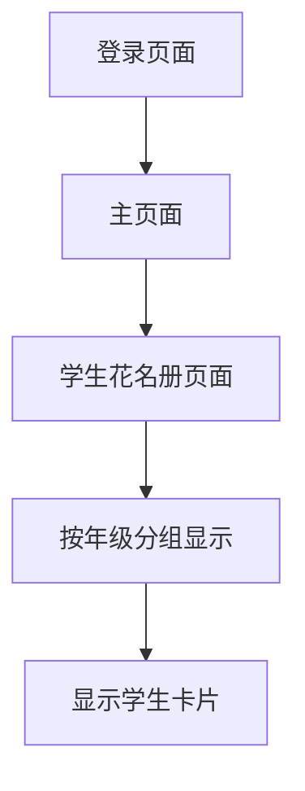

# 学生花名册功能需求文档

## 1. 产品概述

学生花名册是一个用于展示定向队员信息的页面，按年级分组显示所有学生的基本信息和统计数据。该功能为教练提供了一个清晰、直观的学生总览界面，便于管理和查看队员信息。

## 2. 核心功能

### 2.1 用户角色

| 角色 | 访问权限 | 核心权限 |
|------|----------|----------|
| 教练 | 登录后访问 | 查看所有学生花名册，按年级浏览学生信息 |
| 学生 | 登录后访问 | 查看花名册（只读权限） |

### 2.2 功能模块

本功能包含以下主要页面：
1. **学生花名册页面**：显示按年级分组的学生信息，包含头像、姓名、班级等详细信息

### 2.3 页面详情

| 页面名称 | 模块名称 | 功能描述 |
|----------|----------|----------|
| 学生花名册页面 | 页面标题 | 显示"2024届定向队员名册（总人数）"，动态显示学生总数 |
| 学生花名册页面 | 年级分组 | 按初一、初二、初三、高一、高二、高三分组显示学生 |
| 学生花名册页面 | 年级统计 | 每个年级显示"年级：（总人数，男生数男女生数女）"格式的统计信息 |
| 学生花名册页面 | 学生卡片 | 显示学生头像、姓名、具体班级信息，每行5个学生 |
| 学生花名册页面 | 响应式布局 | 支持不同屏幕尺寸，移动端自适应显示 |

## 3. 核心流程

**教练查看花名册流程：**
1. 教练登录系统
2. 导航到学生花名册页面
3. 系统自动按年级分组显示学生
4. 教练可浏览各年级学生信息和统计数据

**学生查看花名册流程：**
1. 学生登录系统
2. 导航到学生花名册页面
3. 查看所有年级的学生信息（只读模式）

## 4. 用户界面设计

### 4.1 设计风格

- **主色调**：蓝色系（#3B82F6）和白色背景
- **辅助色**：灰色系用于文本和边框
- **按钮样式**：圆角设计，悬停效果
- **字体**：系统默认字体，标题使用较大字号
- **布局风格**：卡片式布局，清晰的分组结构
- **图标样式**：简洁的线性图标

### 4.2 页面设计概览

| 页面名称 | 模块名称 | UI元素 |
|----------|----------|--------|
| 学生花名册页面 | 页面标题 | 大标题文字，居中显示，包含总人数统计 |
| 学生花名册页面 | 年级分组标题 | 年级名称 + 统计信息，左对齐，加粗显示 |
| 学生花名册页面 | 学生卡片 | 圆形头像、学生姓名、班级信息，卡片式布局 |
| 学生花名册页面 | 网格布局 | 每行5个学生卡片，响应式调整 |

### 4.3 响应式设计

- **桌面端**：每行显示5个学生卡片
- **平板端**：每行显示3-4个学生卡片
- **移动端**：每行显示2个学生卡片，优化触摸交互