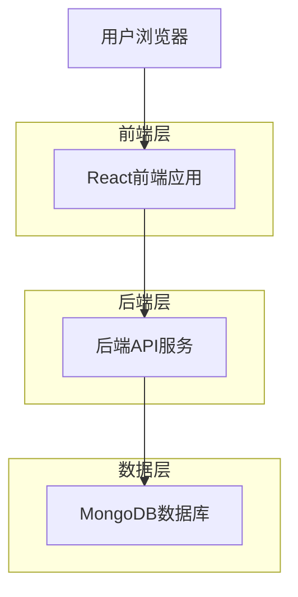
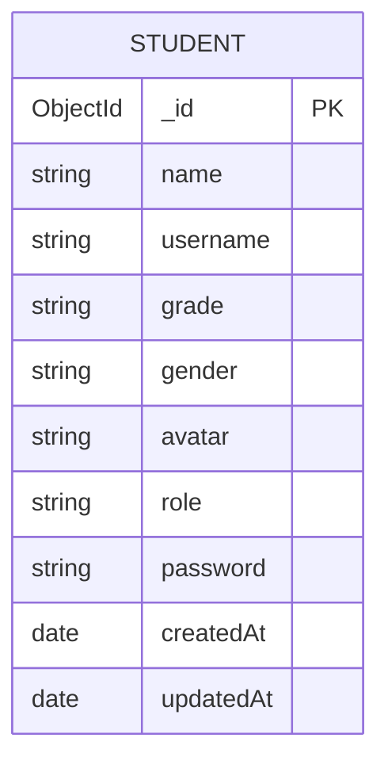

# 学生花名册技术架构文档

## 1. 架构设计



## 2. 技术描述

- 前端：React@18 + tailwindcss@3 + vite
- 后端：Express@4 + Node.js
- 数据库：MongoDB (现有)

## 3. 路由定义

| 路由 | 用途 |
|------|------|
| /coach/roster | 学生花名册页面，显示按年级分组的学生信息 |
| /student/roster | 学生查看花名册页面（只读模式） |

## 4. API定义

### 4.1 核心API

获取学生花名册数据
```
GET /api/students/roster
```

请求参数：无

响应数据：
| 参数名称 | 参数类型 | 描述 |
|----------|----------|------|
| success | boolean | 请求状态 |
| data | object | 花名册数据 |
| data.totalCount | number | 学生总数 |
| data.gradeGroups | array | 按年级分组的学生数据 |

示例响应：
```json
{
  "success": true,
  "data": {
    "totalCount": 60,
    "gradeGroups": [
      {
        "gradeName": "初一",
        "totalCount": 19,
        "maleCount": 9,
        "femaleCount": 10,
        "students": [
          {
            "_id": "...",
            "name": "张三",
            "grade": "初一3班",
            "gender": "male",
            "avatar": "..."
          }
        ]
      }
    ]
  }
}
```

更新学生性别信息
```
PUT /api/students/:id/gender
```

请求参数：
| 参数名称 | 参数类型 | 是否必需 | 描述 |
|----------|----------|----------|------|
| gender | string | true | 学生性别 (male/female) |

响应数据：
| 参数名称 | 参数类型 | 描述 |
|----------|----------|------|
| success | boolean | 更新状态 |
| message | string | 响应消息 |

## 5. 数据模型

### 5.1 数据模型定义



### 5.2 数据定义语言

学生表更新（添加性别字段）
```javascript
// 更新Student模型，添加gender字段
const studentSchema = new mongoose.Schema({
  name: { type: String, required: true },
  username: { type: String, required: true, unique: true },
  grade: { type: String, required: true },
  gender: { 
    type: String, 
    enum: ['male', 'female'], 
    default: 'male' 
  },
  avatar: { type: String, default: '' },
  role: { type: String, default: 'student' },
  password: { type: String, required: true }
}, {
  timestamps: true
});

// 为现有学生添加默认性别
db.students.updateMany(
  { gender: { $exists: false } },
  { $set: { gender: 'male' } }
);

// 创建索引优化查询性能
db.students.createIndex({ grade: 1 });
db.students.createIndex({ gender: 1 });
```

## 6. 核心功能实现

### 6.1 年级解析逻辑

```javascript
// 从"初二12班"中提取"初二"
function extractGradeLevel(gradeString) {
  const gradeMap = {
    '初一': '初一',
    '初二': '初二', 
    '初三': '初三',
    '高一': '高一',
    '高二': '高二',
    '高三': '高三'
  };
  
  for (const [key, value] of Object.entries(gradeMap)) {
    if (gradeString.includes(key)) {
      return value;
    }
  }
  return '其他';
}
```

### 6.2 数据分组和统计

```javascript
// 后端数据处理逻辑
function groupStudentsByGrade(students) {
  const gradeOrder = ['初一', '初二', '初三', '高一', '高二', '高三'];
  const grouped = {};
  
  // 按年级分组
  students.forEach(student => {
    const gradeLevel = extractGradeLevel(student.grade);
    if (!grouped[gradeLevel]) {
      grouped[gradeLevel] = [];
    }
    grouped[gradeLevel].push(student);
  });
  
  // 按预定义顺序排序并统计
  return gradeOrder.map(grade => {
    const gradeStudents = grouped[grade] || [];
    const maleCount = gradeStudents.filter(s => s.gender === 'male').length;
    const femaleCount = gradeStudents.filter(s => s.gender === 'female').length;
    
    return {
      gradeName: grade,
      totalCount: gradeStudents.length,
      maleCount,
      femaleCount,
      students: gradeStudents
    };
  }).filter(group => group.totalCount > 0);
}
```

### 6.3 前端组件结构

```javascript
// 主要组件结构
StudentRoster/
├── StudentRosterPage.jsx     // 主页面组件
├── GradeSection.jsx          // 年级分组组件
├── StudentCard.jsx           // 学生卡片组件
└── RosterHeader.jsx          // 页面标题组件
```