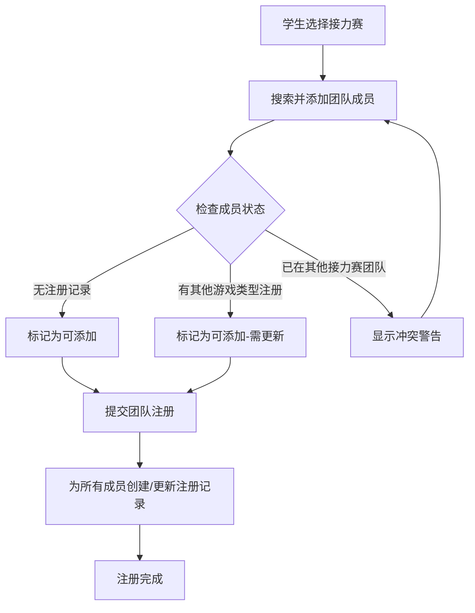

# 接力赛团队注册增强功能需求文档

## 1. 产品概述

本文档描述接力赛团队注册功能的增强需求，主要解决当前团队注册流程中缺失的自动化处理和用户体验问题。当学生发起接力赛团队注册并添加团队成员时，系统需要自动为所有团队成员创建或更新注册记录，同时提供团队冲突检测和改进的用户界面交互。

## 2. 核心功能

### 2.1 用户角色
本功能主要面向学生用户，无需区分不同角色权限。

### 2.2 功能模块

本需求涉及以下主要页面的增强：
1. **事件注册页面**：接力赛团队组建和成员管理功能增强
2. **学生搜索组件**：自动完成下拉框的键盘导航功能

### 2.3 页面详情

| 页面名称 | 模块名称 | 功能描述 |
|----------|----------|----------|
| 事件注册页面 | 团队成员自动注册 | 提交团队注册时，自动为所有团队成员创建事件注册记录，包含相同的团队信息和接力赛游戏类型 |
| 事件注册页面 | 已有注册记录更新 | 检测团队成员是否已有其他游戏类型的注册记录，如有则更新该记录添加接力赛游戏类型 |
| 事件注册页面 | 团队冲突检测 | 在添加团队成员时检查该成员是否已加入其他接力赛团队，如是则显示警告提示 |
| 学生搜索组件 | 键盘导航 | 在学生搜索自动完成下拉框中支持上下箭头键选择选项 |

## 3. 核心流程

### 3.1 团队注册主流程

**学生发起接力赛团队注册流程：**
1. 学生进入事件注册页面，选择接力赛游戏类型
2. 学生通过搜索功能添加团队成员
3. 系统实时检测团队成员的可用性状态
4. 学生确认团队信息并提交注册
5. 系统自动为所有团队成员创建或更新注册记录
6. 返回注册成功确认信息

### 3.2 团队成员处理流程

**团队成员注册记录处理逻辑：**
- 如果成员无任何注册记录：创建新的事件注册记录
- 如果成员已有其他游戏类型注册：更新现有记录，添加接力赛游戏类型
- 如果成员已在其他接力赛团队：显示冲突警告，阻止添加

## 4. 用户界面设计

### 4.1 设计风格
- **主色调**：蓝色系（#3B82F6）和绿色系（#10B981）
- **按钮样式**：圆角按钮，悬停效果
- **字体**：系统默认字体，标题16px，正文14px
- **布局风格**：卡片式布局，响应式设计
- **图标风格**：线性图标，警告使用橙色，错误使用红色

### 4.2 页面设计概览

| 页面名称 | 模块名称 | UI元素 |
|----------|----------|--------|
| 事件注册页面 | 团队成员列表 | 成员卡片显示头像、姓名、状态标识；删除按钮；状态指示器（可用/冲突/需更新） |
| 事件注册页面 | 成员搜索框 | 自动完成下拉框，支持键盘导航；高亮当前选中项；成员状态预览 |
| 事件注册页面 | 冲突警告提示 | 橙色警告框，显示冲突详情和建议操作；关闭按钮 |
| 事件注册页面 | 提交确认对话框 | 显示将要处理的成员列表；创建/更新操作说明；确认和取消按钮 |

### 4.3 响应式设计
本功能主要面向桌面端使用，同时兼容移动端触摸操作，确保搜索下拉框在移动设备上的可用性。