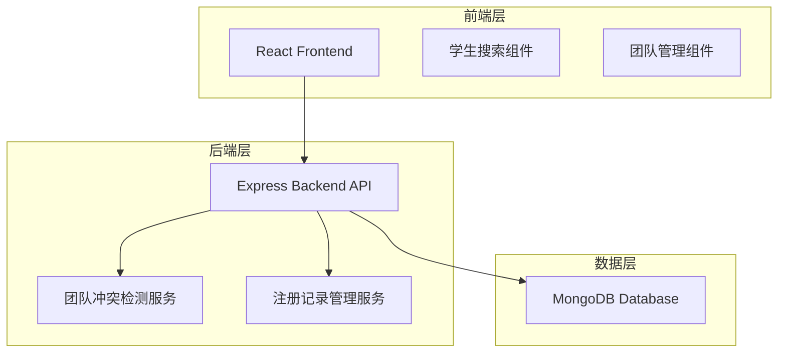
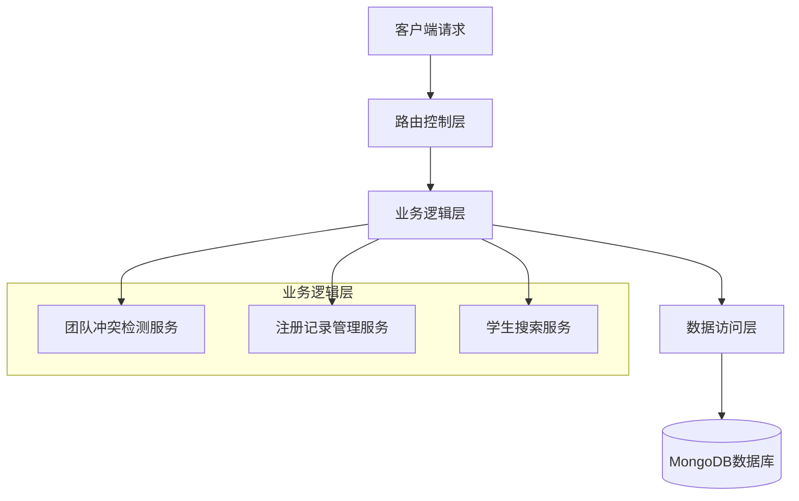
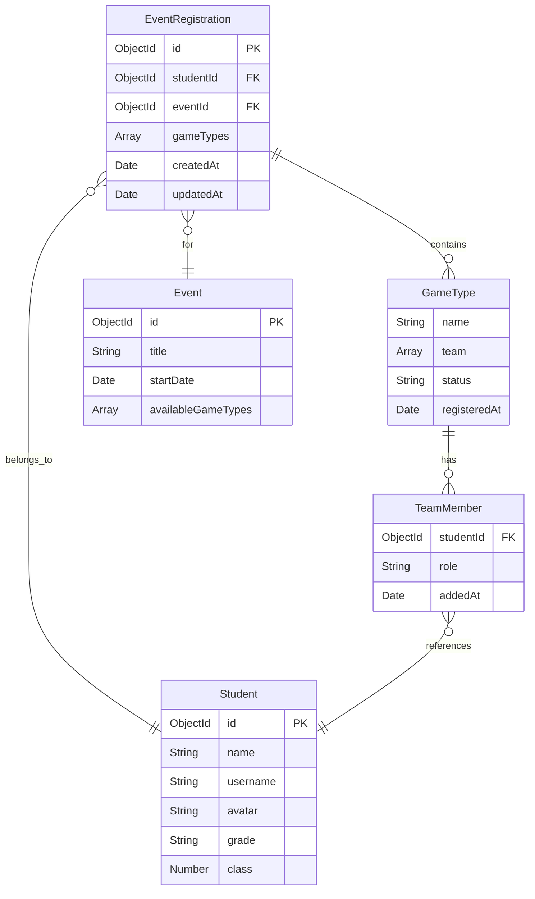

# 接力赛团队注册增强技术架构文档

## 1. 架构设计



## 2. 技术描述

- 前端：React@18 + tailwindcss@3 + vite
- 后端：Express@4 + Mongoose
- 数据库：MongoDB (现有orienteeringx数据库)

## 3. 路由定义

| 路由 | 用途 |
|------|------|
| /events/:eventId/register | 事件注册页面，包含增强的团队注册功能 |
| /api/students/search | 学生搜索API，支持团队状态检查 |
| /api/registrations/team-check | 团队成员冲突检测API |
| /api/registrations/batch-create | 批量创建/更新团队成员注册记录API |

## 4. API定义

### 4.1 核心API

**学生搜索与状态检查**
```
GET /api/students/search?q={query}&eventId={eventId}
```

请求参数：
| 参数名 | 参数类型 | 是否必需 | 描述 |
|--------|----------|----------|------|
| q | string | true | 搜索关键词 |
| eventId | string | true | 事件ID |

响应：
| 字段名 | 字段类型 | 描述 |
|--------|----------|------|
| students | array | 学生列表 |
| students[].id | string | 学生ID |
| students[].name | string | 学生姓名 |
| students[].avatar | string | 学生头像 |
| students[].teamStatus | string | 团队状态：available/in_team/registered |
| students[].conflictInfo | object | 冲突信息（如果存在） |

**团队成员冲突检测**
```
POST /api/registrations/team-check
```

请求：
| 参数名 | 参数类型 | 是否必需 | 描述 |
|--------|----------|----------|------|
| eventId | string | true | 事件ID |
| studentIds | array | true | 待检查的学生ID列表 |
| gameType | string | true | 游戏类型（接力赛） |

响应：
| 参数名 | 参数类型 | 描述 |
|--------|----------|------|
| conflicts | array | 冲突列表 |
| conflicts[].studentId | string | 冲突学生ID |
| conflicts[].reason | string | 冲突原因 |
| conflicts[].existingTeam | object | 现有团队信息 |

**批量创建/更新注册记录**
```
POST /api/registrations/batch-create
```

请求：
| 参数名 | 参数类型 | 是否必需 | 描述 |
|--------|----------|----------|------|
| eventId | string | true | 事件ID |
| teamInfo | object | true | 团队信息 |
| members | array | true | 团队成员列表 |
| gameType | object | true | 游戏类型信息 |

响应：
| 参数名 | 参数类型 | 描述 |
|--------|----------|------|
| success | boolean | 操作是否成功 |
| created | array | 新创建的注册记录ID |
| updated | array | 更新的注册记录ID |
| errors | array | 错误信息 |

## 5. 服务器架构图



## 6. 数据模型

### 6.1 数据模型定义



### 6.2 数据定义语言

**EventRegistration 集合增强**
```javascript
// 现有EventRegistration模型无需修改结构
// 新增索引以优化团队冲突检测查询性能
db.eventregistrations.createIndex({ 
    "eventId": 1, 
    "gameTypes.name": 1, 
    "gameTypes.team.studentId": 1 
});

// 新增复合索引用于快速查找学生的注册状态
db.eventregistrations.createIndex({ 
    "studentId": 1, 
    "eventId": 1 
});
```

**团队冲突检测查询示例**
```javascript
// 检查学生是否已在接力赛团队中
const conflictCheck = await EventRegistration.aggregate([
    {
        $match: {
            eventId: ObjectId(eventId),
            "gameTypes.name": "接力赛",
            "gameTypes.team.studentId": { $in: studentIds }
        }
    },
    {
        $unwind: "$gameTypes"
    },
    {
        $match: {
            "gameTypes.name": "接力赛"
        }
    },
    {
        $unwind: "$gameTypes.team"
    },
    {
        $match: {
            "gameTypes.team.studentId": { $in: studentIds }
        }
    },
    {
        $group: {
            _id: "$gameTypes.team.studentId",
            existingTeams: { $push: "$_id" }
        }
    }
]);
```

**批量创建/更新操作示例**
```javascript
// 批量更新现有注册记录
const bulkOps = members.map(member => ({
    updateOne: {
        filter: { 
            studentId: member.studentId, 
            eventId: eventId 
        },
        update: {
            $push: {
                gameTypes: {
                    name: "接力赛",
                    team: teamMembers,
                    status: "待确认",
                    registeredAt: new Date()
                }
            }
        },
        upsert: true
    }
}));

await EventRegistration.bulkWrite(bulkOps);
```