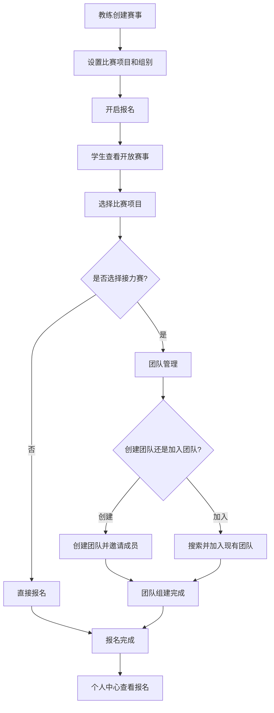

# 赛事报名系统功能需求文档

## 1. 产品概述

赛事报名系统是定向越野应用的核心功能模块，为俱乐部和政府组织的定向越野赛事提供完整的报名管理解决方案。系统支持多样化的比赛项目配置、灵活的组别设置、团队赛事的组队功能，以及完整的报名流程管理。

该系统解决了传统赛事报名流程复杂、组队困难、数据管理分散等问题，为教练、学生和赛事组织者提供统一的数字化平台，提升赛事组织效率和参赛体验。

## 2. 核心功能

### 2.1 用户角色

| 角色 | 注册方式 | 核心权限 |
|------|----------|----------|
| 教练 | 管理员分配 | 创建和管理赛事、查看所有报名数据、导出报名信息、管理学生报名 |
| 学生 | 邮箱注册或教练添加 | 浏览开放赛事、个人报名、创建/加入团队、管理个人报名记录 |

### 2.2 功能模块

赛事报名系统包含以下核心页面：

1. **赛事管理页面**：赛事列表展示、赛事创建/编辑、比赛项目配置、组别设置
2. **赛事详情编辑页面**：基本信息编辑、比赛项目管理、组别管理
3. **赛事报名页面**：比赛项目选择、团队组建、报名确认
4. **团队邀请页面**：团队信息展示、加入团队确认
5. **个人中心报名管理**：报名记录查看、报名状态管理
6. **仪表板赛事展示**：开放赛事列表、快速报名入口
7. **教练报名管理页面**：报名数据查看、Excel导出、统计分析

### 2.3 页面详情

| 页面名称 | 模块名称 | 功能描述 |
|----------|----------|----------|
| 赛事管理页面 | 赛事列表 | 展示所有赛事、筛选和搜索、状态管理、快速操作 |
| 赛事管理页面 | 操作按钮 | 创建新赛事、编辑赛事、删除赛事、开启/关闭报名 |
| 赛事详情编辑页面 | 基本信息面板 | 编辑赛事名称、组织方、类型、时间、地点、积分权重 |
| 赛事详情编辑页面 | 比赛项目标签页 | 添加/删除比赛项目、设置接力赛标识、配置团队人数 |
| 赛事详情编辑页面 | 组别标签页 | 添加/删除参赛组别、组别代码管理、年龄段设置 |
| 赛事报名页面 | 赛事信息展示 | 显示赛事基本信息、比赛项目列表、组别信息 |
| 赛事报名页面 | 项目选择区域 | 多选比赛项目、接力赛特殊处理、实时验证 |
| 赛事报名页面 | 团队管理区域 | 创建团队、搜索加入团队、团队成员管理、邀请链接生成 |
| 团队邀请页面 | 邀请信息展示 | 显示赛事信息、团队信息、创建者信息 |
| 团队邀请页面 | 加入确认 | 确认加入团队、自动创建报名记录、权限验证 |
| 个人中心 | 我的报名标签页 | 查看所有报名记录、编辑报名信息、取消报名 |
| 仪表板 | 赛事报名区域 | 展示开放报名的赛事卡片、快速报名按钮、赛事详情预览 |
| 教练报名管理 | 报名统计 | 查看报名人数统计、项目分布、组别分析 |
| 教练报名管理 | 数据导出 | Excel格式导出、自定义字段选择、批量操作 |

## 3. 核心流程

### 3.1 教练赛事管理流程

1. 教练登录系统，进入赛事管理页面
2. 点击"创建赛事"按钮，跳转到赛事编辑页面
3. 填写赛事基本信息（名称、组织方、时间等）
4. 在"比赛项目"标签页添加项目，设置接力赛标识和团队人数
5. 在"组别"标签页添加参赛组别
6. 保存赛事信息，设置"开放报名"状态
7. 分享报名链接给学生或公开发布

### 3.2 学生个人报名流程

1. 学生通过仪表板或报名链接进入赛事报名页面
2. 查看赛事信息和可选比赛项目
3. 选择要参加的比赛项目（多选）
4. 如选择接力赛，进入团队管理流程
5. 确认报名信息并提交
6. 在个人中心查看报名状态

### 3.3 团队组建流程

1. 学生选择接力赛项目后，显示团队管理区域
2. 选择"创建团队"或"加入现有团队"
3. 创建团队：输入团队名称，系统生成成员占位符
4. 通过搜索添加团队成员或生成邀请链接
5. 其他学生通过邀请链接加入团队
6. 团队满员后自动锁定，不再接受新成员

## 4. 用户界面设计

### 4.1 设计风格

- **主色调**：蓝色系 (#3B82F6) 作为主色，绿色 (#10B981) 作为成功状态色
- **按钮样式**：圆角按钮设计，主要操作使用实心按钮，次要操作使用边框按钮
- **字体**：中文使用思源黑体，英文使用 Inter，主要文字 16px，辅助文字 14px
- **布局风格**：卡片式布局，清晰的信息层级，充足的留白空间
- **图标风格**：线性图标，统一的视觉语言，支持主题色彩适配

### 4.2 页面设计概览

| 页面名称 | 模块名称 | UI元素 |
|----------|----------|--------|
| 赛事管理页面 | 赛事列表 | 表格布局，状态标签，操作按钮组，搜索筛选栏 |
| 赛事详情编辑页面 | 基本信息面板 | 表单布局，输入框，日期选择器，数值输入框 |
| 赛事详情编辑页面 | 标签页导航 | 水平标签页，"比赛项目"和"组别"两个标签 |
| 赛事详情编辑页面 | 比赛项目管理 | 动态列表，添加/删除按钮，接力赛复选框，人数选择器 |
| 赛事报名页面 | 项目选择 | 复选框组，项目卡片，接力赛特殊标识 |
| 赛事报名页面 | 团队管理 | 折叠面板，成员列表，搜索框，邀请链接按钮 |
| 个人中心 | 报名记录 | 卡片列表，状态徽章，操作菜单 |
| 仪表板 | 赛事卡片 | 网格布局，信息卡片，"我要报名"按钮，项目标签 |

### 4.3 响应式设计

系统采用移动优先的响应式设计，支持桌面端、平板端和移动端访问。在移动端优化表格显示，使用卡片布局替代复杂表格，确保核心功能在小屏幕设备上的可用性。