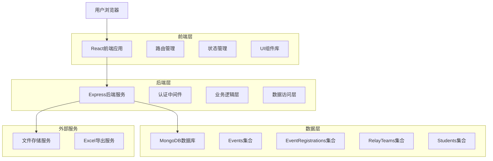
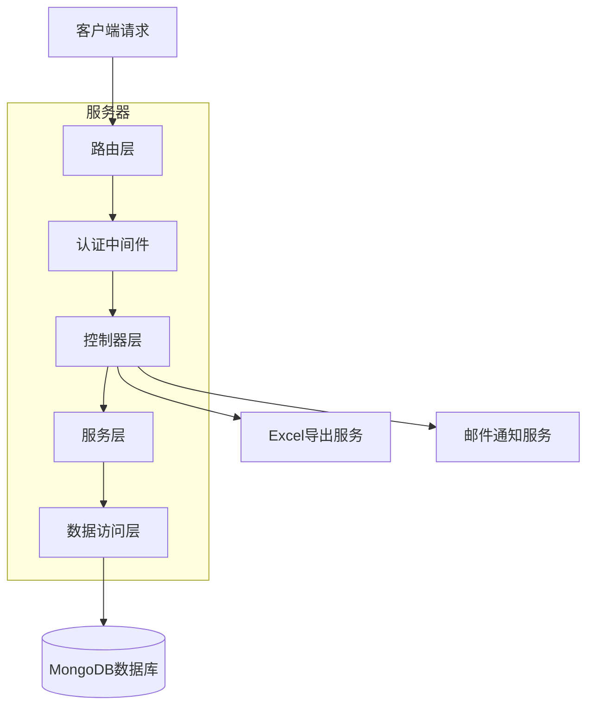
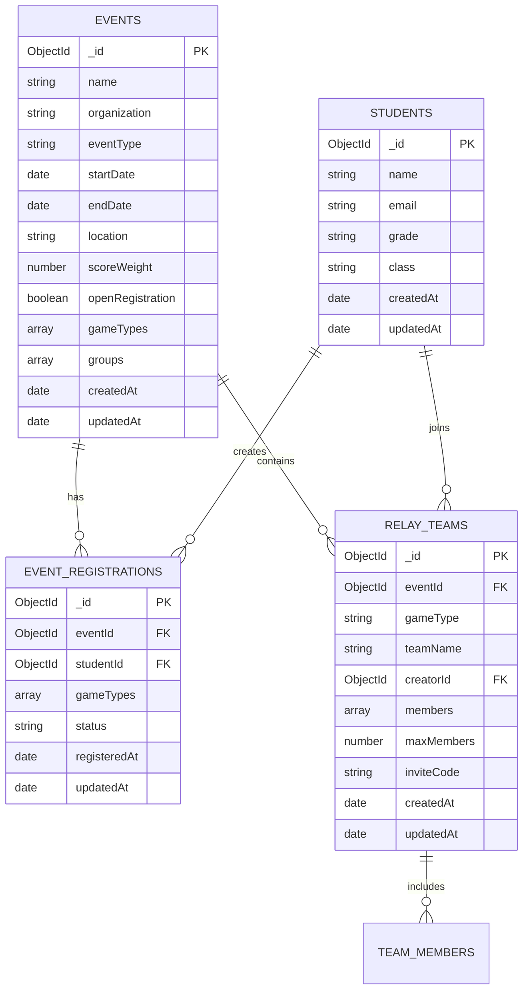

# 赛事报名系统技术架构文档

## 1. 架构设计



## 2. 技术描述

- 前端：React@18 + React Router@6 + Tailwind CSS@3 + Vite
- 后端：Express@4 + MongoDB + Mongoose
- 认证：JWT Token + bcrypt密码加密
- 文件处理：multer + xlsx库用于Excel导出
- 状态管理：React Context + useReducer

## 3. 路由定义

| 路由 | 用途 |
|------|------|
| /coach/events | 赛事管理主页面，显示赛事列表和管理功能 |
| /coach/events/create | 创建新赛事页面，包含基本信息和项目组别配置 |
| /coach/events/edit/:id | 编辑现有赛事页面，支持完整的赛事信息修改 |
| /coach/events/registrations | 教练查看报名管理页面，包含统计和导出功能 |
| /events/register/:eventId | 学生赛事报名页面，支持项目选择和团队管理 |
| /events/team/invite/:teamId | 团队邀请页面，处理团队加入流程 |
| /profile/registrations | 个人报名记录管理页面 |
| /dashboard | 仪表板页面，显示开放报名的赛事 |

## 4. API定义

### 4.1 赛事管理API

**获取赛事列表**
```
GET /api/events
```

查询参数：
| 参数名 | 参数类型 | 是否必需 | 描述 |
|--------|----------|----------|------|
| page | number | false | 页码，默认为1 |
| limit | number | false | 每页数量，默认为10 |
| status | string | false | 赛事状态筛选 |
| openRegistration | boolean | false | 是否开放报名 |

响应：
| 参数名 | 参数类型 | 描述 |
|--------|----------|------|
| success | boolean | 请求是否成功 |
| data | object | 赛事列表数据 |
| pagination | object | 分页信息 |

**创建赛事**
```
POST /api/events
```

请求体：
| 参数名 | 参数类型 | 是否必需 | 描述 |
|--------|----------|----------|------|
| name | string | true | 赛事名称 |
| organization | string | true | 组织方 |
| eventType | string | true | 赛事类型 |
| startDate | date | true | 开始日期 |
| endDate | date | true | 结束日期 |
| location | string | true | 举办地点 |
| scoreWeight | number | true | 积分权重 |
| gameTypes | array | true | 比赛项目列表 |
| groups | array | true | 参赛组别列表 |

### 4.2 报名管理API

**创建报名记录**
```
POST /api/registrations
```

请求体：
| 参数名 | 参数类型 | 是否必需 | 描述 |
|--------|----------|----------|------|
| eventId | ObjectId | true | 赛事ID |
| studentId | ObjectId | true | 学生ID |
| gameTypes | array | true | 选择的比赛项目 |
| relayTeams | array | false | 接力赛团队信息 |

**获取报名统计**
```
GET /api/events/:eventId/registrations/stats
```

响应：
| 参数名 | 参数类型 | 描述 |
|--------|----------|------|
| totalRegistrations | number | 总报名人数 |
| gameTypeStats | array | 各项目报名统计 |
| groupStats | array | 各组别报名统计 |

### 4.3 团队管理API

**创建接力团队**
```
POST /api/relay-teams
```

请求体：
| 参数名 | 参数类型 | 是否必需 | 描述 |
|--------|----------|----------|------|
| eventId | ObjectId | true | 赛事ID |
| gameType | string | true | 比赛项目 |
| teamName | string | true | 团队名称 |
| creatorId | ObjectId | true | 创建者ID |

**加入团队**
```
POST /api/relay-teams/:teamId/join
```

请求体：
| 参数名 | 参数类型 | 是否必需 | 描述 |
|--------|----------|----------|------|
| studentId | ObjectId | true | 学生ID |

## 5. 服务器架构图



## 6. 数据模型

### 6.1 数据模型定义



### 6.2 数据定义语言

**赛事表 (events)**
```javascript
// 扩展现有events集合
db.events.updateMany({}, {
  $set: {
    scoreWeight: 1.0,
    openRegistration: false,
    gameTypes: [],
    groups: []
  }
});

// 创建索引
db.events.createIndex({ "openRegistration": 1 });
db.events.createIndex({ "startDate": 1 });
db.events.createIndex({ "organization": 1 });
```

**赛事报名表 (eventRegistrations)**
```javascript
// 创建赛事报名集合
db.createCollection("eventRegistrations");

// 插入示例数据
db.eventRegistrations.insertOne({
  eventId: ObjectId("..."),
  studentId: ObjectId("..."),
  gameTypes: ["短距离", "积分赛"],
  status: "confirmed",
  registeredAt: new Date(),
  updatedAt: new Date()
});

// 创建索引
db.eventRegistrations.createIndex({ "eventId": 1, "studentId": 1 }, { unique: true });
db.eventRegistrations.createIndex({ "eventId": 1 });
db.eventRegistrations.createIndex({ "studentId": 1 });
db.eventRegistrations.createIndex({ "status": 1 });
```

**接力团队表 (relayTeams)**
```javascript
// 创建接力团队集合
db.createCollection("relayTeams");

// 插入示例数据
db.relayTeams.insertOne({
  eventId: ObjectId("..."),
  gameType: "接力赛",
  teamName: "闪电队",
  creatorId: ObjectId("..."),
  members: [
    {
      _id: ObjectId(),
      studentId: ObjectId("..."),
      joinedAt: new Date()
    },
    {
      _id: ObjectId(),
      studentId: null,
      joinedAt: null
    }
  ],
  maxMembers: 3,
  inviteCode: "ABC123",
  createdAt: new Date(),
  updatedAt: new Date()
});

// 创建索引
db.relayTeams.createIndex({ "eventId": 1, "gameType": 1 });
db.relayTeams.createIndex({ "inviteCode": 1 }, { unique: true });
db.relayTeams.createIndex({ "creatorId": 1 });
db.relayTeams.createIndex({ "members.studentId": 1 });
```

**游戏类型数据结构**
```javascript
// gameTypes数组中的对象结构
{
  name: "接力赛",
  isRelay: true,
  groupHeadCount: 3,
  description: "团队接力比赛"
}

{
  name: "短距离",
  isRelay: false,
  groupHeadCount: 1,
  description: "个人短距离比赛"
}
```

**组别数据结构**
```javascript
// groups数组中的对象结构
{
  code: "M14",
  name: "男子14岁组",
  ageRange: "13-14",
  gender: "male"
}

{
  code: "E21A",
  name: "女子21岁A组",
  ageRange: "21+",
